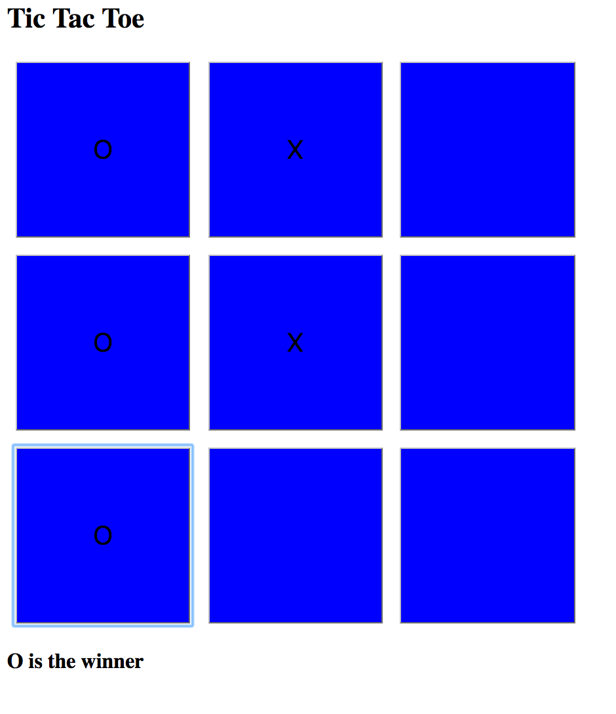
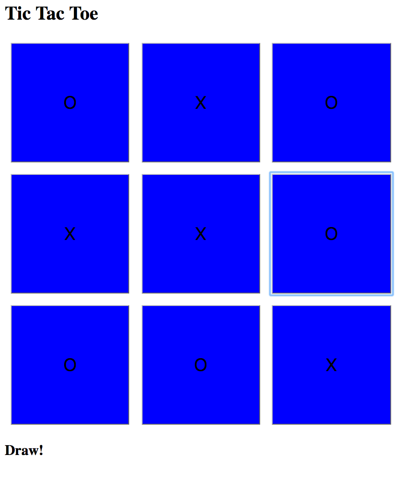

# Tic Tac Toe Test

Specifications
==============

The rules of tic-tac-toe are as follows:

* There are two players in the game (X and O)
* Players take turns until the game is over
* A player can claim a field if it is not already taken
* A turn ends when a player claims a field
* A player wins if they claim all fields in a row, column or diagonal
* A game is over if a player wins
* A game is over when all fields are taken

Approach and Technologies used
==============================

* Code written in Javascript
* Tests written using Jasmine

The project uses four main classes:

**Cell** responsible for the position and contents of each square in the grid.

**Grid** responsible for storing an array of cells and the winning combination. It checks for spaces and places the player's move on the grid.

**Player** stores an i.d of either "X" or "O".

**Game** responsible for storing each player and the grid. After each move the game switches the turns correctly and allows a move to be played.

Instructions and Installation
=============================

1. Fork and clone this repository

2. To see the tests, open SpecRunner.html into any browser. It should be ./yourPath/SpecRunner.html

3. To play, open index.html into a browser.

Example
=======

After a winner:

After a draw:

Further Features
================

* Declare on the screen the correct winner.
* Allow players to enter their names.
* Highlight the winning move.
